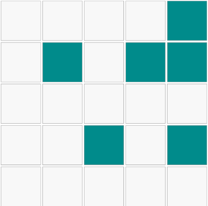
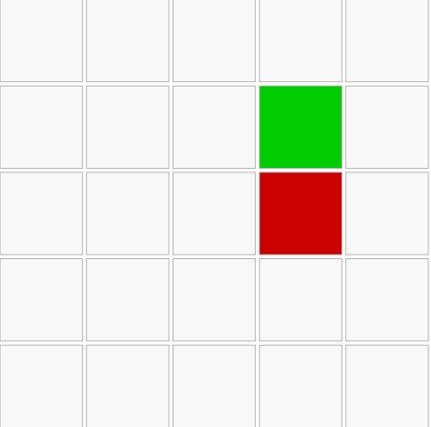

# Memory Grid Game

This game will show the player a grid with many cells and `highlight` a few random ones. 
The player is expected to `memorize` the positions of the highlighted cells.
The game will then `clear` the highlighted cells and `challenge` the user to `recall` their positions from memory.

# 
### Memorize State...

# 
### Recall State...